# n8n-nodes-discord-bridge


This project is a fork of [n8n-nodes-discord](https://github.com/edbrdi/n8n-nodes-discord) with improvements and additional features. All modifications and translations have been assisted by AI to ensure accuracy and consistency.

[n8n](https://www.n8n.io) nodes to trigger workflows from Discord or send interactive messages. Uses the components API which allows creating dialogs (for example, attaching buttons and waiting for the user to click on them).

These nodes do not use webhooks but a Discord bot to enable bidirectional communication. The bot automatically starts in a main process once configured and forwards or receives data from child processes when a node is executed.

## Installation

Follow the installation instructions in the [n8n community nodes documentation](https://docs.n8n.io/integrations/community-nodes/installation/).

### Local Development

To start developing this node, you can use the following commands:

```bash
# Install dependencies
npm install

# Start watching for changes
npm run dev

# Build the node
npm run build
```

## Usage

This node provides a bridge between n8n and Discord, allowing you to:

- Trigger n8n workflows from Discord events
- Send interactive messages to Discord channels
- Create dialogs with buttons and wait for user interactions
- Track reactions on messages

## How to Install

### Community Nodes (Recommended)

1. Go to **Settings > Community Nodes**.
2. Select **Install**.
3. Enter `n8n-nodes-discord-bridge` in **Enter npm package name**.
4. Accept the [risks](https://docs.n8n.io/integrations/community-nodes/risks/) of using community nodes: select **I understand the risks of installing unverified code from a public source**.
5. Select **Install**.

After installing the node, you can use it like any other node. n8n displays the node in the **Nodes** panel search results.

### Manual Installation

To get started, install the package in your n8n root directory:

`npm install n8n-nodes-discord-bridge`

For Docker-based deployments, add the following line before the font installation command in your [n8n Dockerfile](https://github.com/n8n-io/n8n/blob/master/docker/images/n8n/Dockerfile):

`RUN cd /usr/local/lib/node_modules/n8n && npm install n8n-nodes-discord-bridge`

## Bot Configuration

To send, listen to messages, get the list of channels or roles, you need to configure a bot using the [Discord Developer Portal](https://discord.com/developers/applications).

First, create an application by clicking **New Application** in the [Developer Portal](https://discord.com/developers/applications).

Go to **OAuth2** and copy the client ID. On your n8n instance, you will create new Discord App credentials (**Credentials > New > Search "Discord App" > Continue**) and paste the Client ID in the corresponding field. Don't close the window yet.

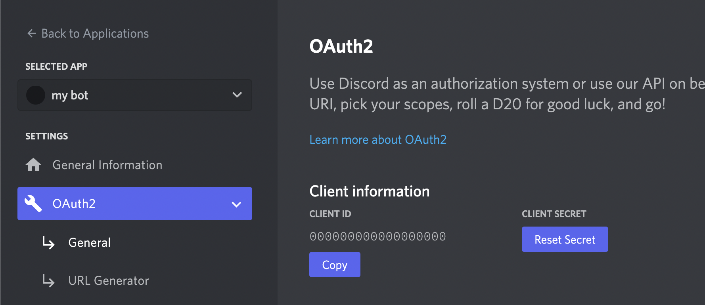

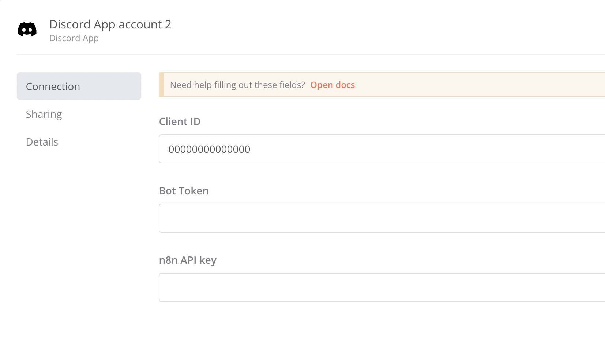

Return to your created application's Discord Developer Portal, go to **Bot** and click **Add Bot**. In the **Authorization Flow**, disable **Public Bot**. Enable all **Privileged Gateway Intents** then save your changes.

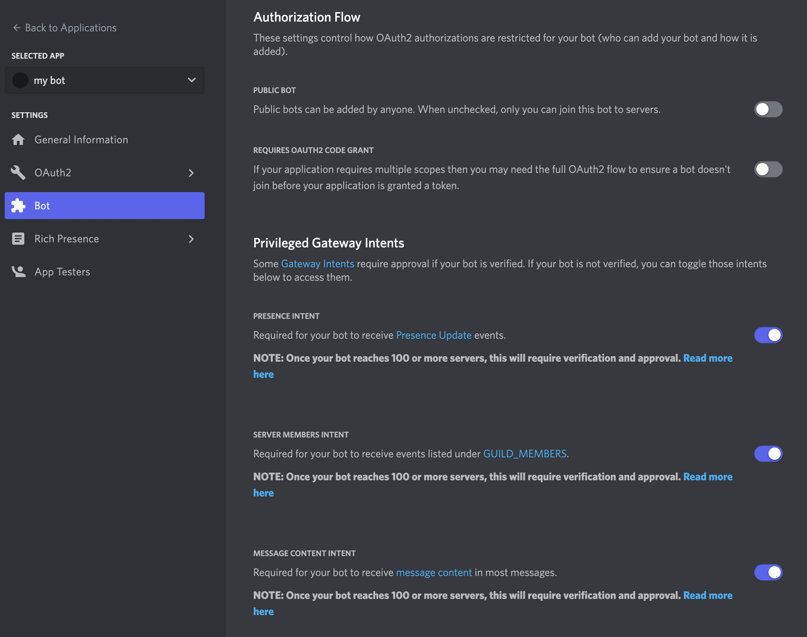

Go to **OAuth > URL Generator**, select the **bot** and **applications.commands** scopes, the bot permission **administrator** then copy the generated URL at the bottom.

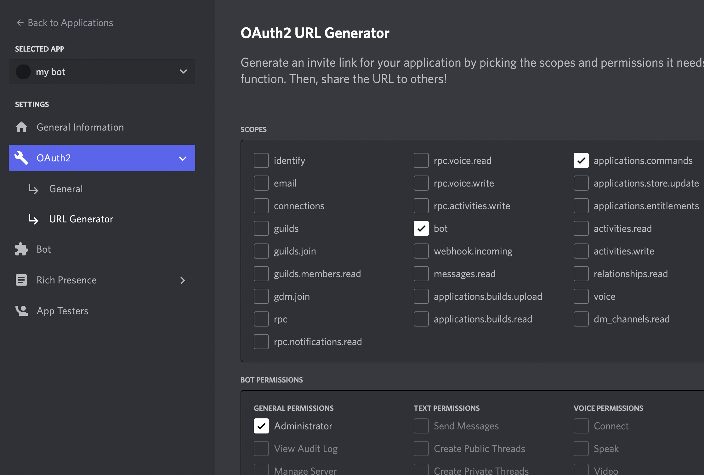

Now use this link to add the bot to your Discord server. You must be logged into Discord in the browser with the same account where you have **Manage Server** or **Administrator** permissions on the server where you want to add the bot.

Once your bot is added to your server, you need to get the bot token and add it to your Discord App credentials. Simply click **Copy** on your bot page or **Reset Token** if the **Copy** button is not visible.

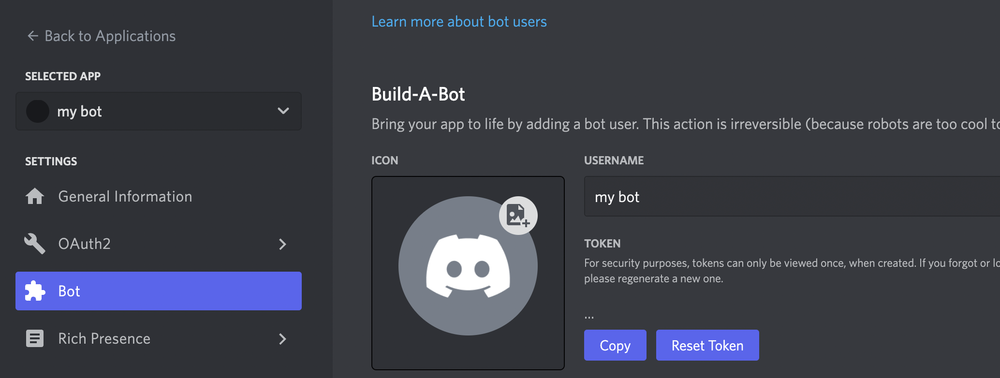

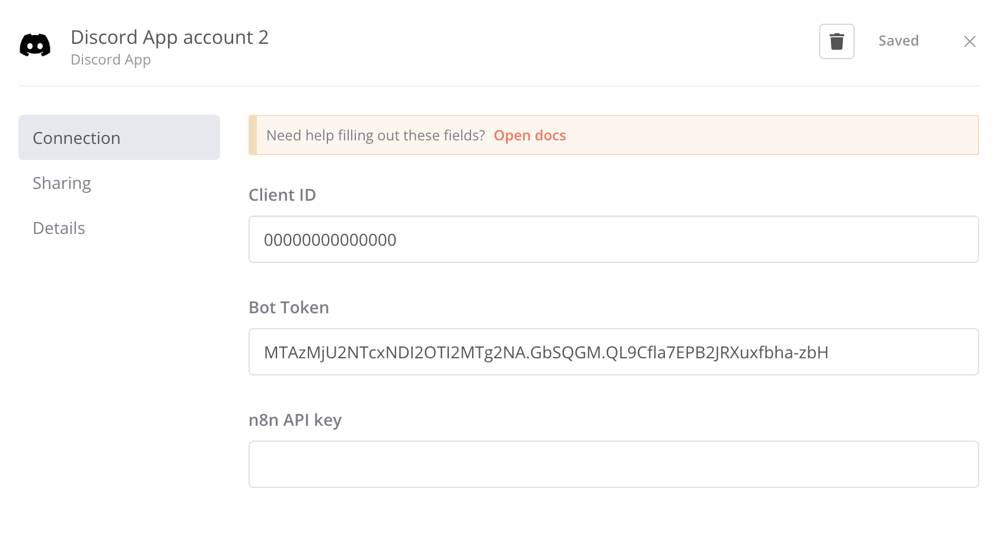

Save your credentials and go to **Settings > n8n API**, click **Create API Key** or select the existing one, copy the key, reopen your Discord App credentials (**Credentials > Open**), paste the key in the **n8n API Key** field and set your base URL (e.g. https://n8n.example.com/api/v1). Don't forget to save again.

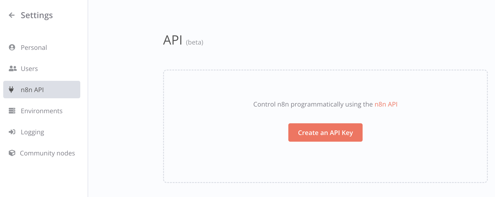

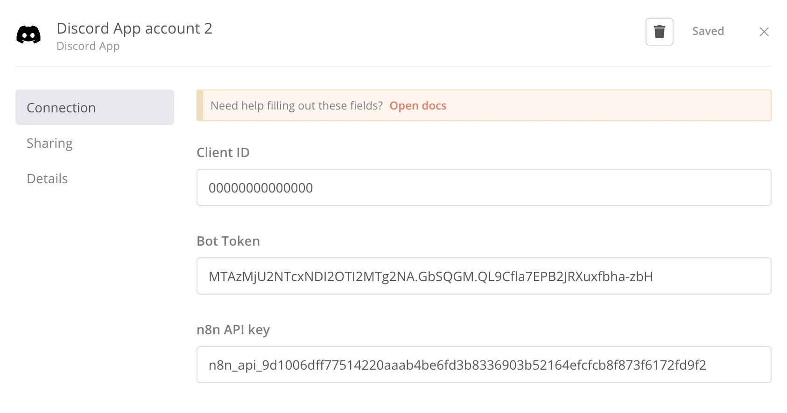

You can now use the **Discord Trigger** and **Discord Send** nodes in your workflows. The first time you configure one of these nodes, it will start the bot.

## Discord Trigger Node Reference

- **Discord App Credentials**: If you followed the bot configuration guide above, you will be able to select your Discord App credentials to start the bot. If you are already using another Discord Trigger (or Send) node, be careful to select the same credentials. It is not currently intended to be used with multiple Discord servers.
- **Listen to**: Lets you select the text channels you want to monitor to trigger the workflow. If none are selected, all channels will be monitored. Your credentials must be configured and the bot running, you also need at least one text channel available. If you don't meet these requirements, make the changes then close and reopen the window (the channels list is loaded when the window opens). For "User" trigger types, if you want to use a placeholder, select the channel where you want it to appear.
- **From roles**: The same logic applies here for roles, except it's optional. If you don't select any role, it will listen to **@everyone**.
- **Trigger type**: Type of event to listen to. User events must specify a channel to listen to if you want to use a placeholder or the "send to trigger channel" option in a Discord Send node.
  - **Message**: Listen to messages sent in selected channels.
  - **Command**: Listen to commands sent in selected channels.
  - **Interaction**: Listen to persistent buttons/select.
  - **Reaction**: Listen to reactions added or removed on messages.
    - **Emojis**: List of emojis separated by commas to monitor. If empty, all emojis will be monitored.
    - **Event Type**: Type of reaction event to monitor.
      - **All events**: Listen to both reaction additions and removals.
      - **Reaction add**: Listen only to reaction additions.
      - **Reaction remove**: Listen only to reaction removals.
  - **User joins**: Listen to users joining the server.
  - **User leaves**: Listen to users leaving the server.
  - **User presence update**: Listen to user presence changes.
  - **User role added**: Listen to roles added to users.
  - **User role removed**: Listen to roles removed from users.
- **Presence**: If the trigger type is a presence update. Type of presence to listen to.
  - **Any change**: When a user presence is updated.
  - **Online**: When a user presence is set to online.
  - **Offline**: When a user presence is set to offline.
  - **Do not disturb**: When a user presence is set to do not disturb.
  - **Idle**: When a user presence is set to idle.
- **From roles**: When listening to user role updates, select which removed or added role should match.
- **Message ID**: If the trigger type is an interaction. The ID of the button/select message to listen to.
- **Pattern**: Messages only. Select how the value below will be recognized. ⚠ Keep in mind that the value will be tested with all mentions removed and a trim applied (spaces removed at the beginning and end). For example `@bot hello` will be tested on `hello`.
  - **Equal**: Matches the exact value.
  - **Starts with**: Matches the beginning of the message with the specified value.
  - **Contains**: Matches the value at any position in the message.
  - **Ends with**: Matches the end of the message with the specified value.
  - **Regex**: Matches the custom ECMAScript regular expression provided.
- **Value**: Messages only. The value you will test on all listened messages.
- **Case Sensitive**: Messages only. Determines if it will be case sensitive when matching the value.
- **Bot Mention**: Messages only. If true, a message will also need to mention the bot to trigger the workflow (this does not exclude other criteria).
- **Name**: Command only. The name of the command to listen to.
- **Description**: Command only. The description of the command to listen to.
- **Input field type**: Command only. The type of the input field.
- **Input field description**: Command only. The description of the input field.
- **Input field required**: Command only. If the input field is required.
- **Placeholder**: The placeholder is a message that will appear in the channel that triggers the workflow. Three animated dots added to the placeholder indicate that the workflow is running. From a Discord Send node, you can set up a response message which will then take the place of this placeholder.

/!\ Don't forget to enable your trigger, even if you just want to test it.

### Returned Data

- **content**: The content of the trigger message (if type message).
- **channelId**: The ID of the trigger channel.
- **userId**: The ID of the trigger user.
- **userName**: The username of the trigger user.
- **userTag**: The tag of the trigger user.
- **interactionValues**: The trigger interaction values (if type interaction).
- **messageId**: The ID of the trigger message (if type message).
- **presence**: The trigger presence status (if type presence update).
- **addedRoles**: The trigger added role (if type role added).
- **removedRoles**: The trigger removed role (if type role removed).
- **userRoles**: List of trigger user role IDs (if type interaction trigger).
- **attachments**: The array of trigger attachments (if type message && attachments sent).
- **reactionEmoji**: The emoji used in the reaction (if type reaction).
- **reactionAction**: The type of reaction action ('add' or 'remove') (if type reaction).

## Discord Send Node Reference

- **Discord App Credentials**: If you followed the bot configuration guide above, you will be able to select your Discord App credentials to start the bot. If you are already using another Discord Trigger (or Send) node, be careful to select the same credentials. It is not currently intended to be used with multiple Discord servers.
- **Replace trigger placeholder**: If active, the message produced by this node will replace the previous placeholder set. It can be a placeholder set by the Discord Trigger node or by another Discord Send node.
- **Send to trigger channel**: If active, the message produced will be sent to the same channel where the workflow was triggered (but not replace the placeholder if there is one).
- **Send to**: Lets you specify the text channels where you want to send the message. Your credentials must be configured and the bot running, you also need at least one text channel available. If you don't meet these requirements, make the changes then close and reopen the window (the channels list is loaded when the window opens).
- **Type**: Lets you choose the type of interaction you want to perform.

  - **Message**: This is the default type, it allows you to send a message without requiring a response.
    - **Content**: Displayed text message.
    - **Embed**: If active, it will allow the creation of rich messages like this: 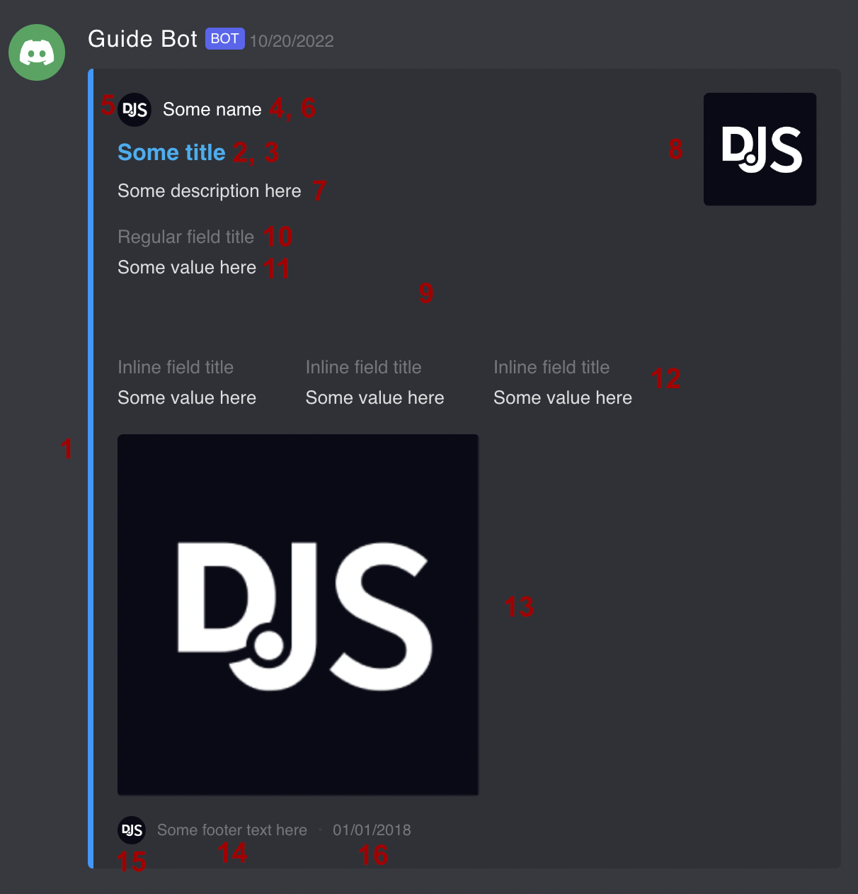
      - **Color** (1)
      - **Title** (2)
      - **URL** (3)
      - **Author Name** (4)
      - **Author Icon URL or base64** (5)
      - **Author URL** (6)
      - **Description** (7)
      - **Thumbnail URL or base64** (8)
      - **Fields** (9)
        - **Field**: If you add an empty field (no title/value), it will create a space in the embed.
          - **Title** (10)
          - **Value** (11)
          - **Inline** (12)
      - **Image URL or base64** (13)
      - **Footer Text** (14)
      - **Footer Icon URL or base64** (15)
      - **Displayed Date** (16)
    - **Files**: Allows attaching up to 5 images to the message.
      - **URL or base64**: URL/base64 of the image to attach (png, jpg).
  - **Prompt with Buttons**: It allows you to send an interactive dialog with buttons that users can click on. The workflow execution will wait until someone responds.
    - **Content**: Displayed text message.
    - **Buttons**: Discord allows adding up to 5 buttons.
      - **Button**
        - **Label**: Label displayed on the button.
        - **Value**: Value returned by the node if clicked.
        - **Style**: You can choose between 4 different styles (primary, secondary, success, danger).
    - **Timeout**: Time (seconds) during which your workflow will wait before moving to the next node (or stopping execution). The remaining time will be displayed and updated at the end of the text message. If the timeout is equal to 0, it will wait indefinitely.
    - **Restrict to trigger user**: Only the user triggering the workflow will be able to interact (others will be ignored).
    - **Restrict to mentioned roles**: Only users having one of the mentioned roles will be able to interact (others will be ignored).
  - **Prompt with Select**: Same as prompt with buttons, but it will display a dropdown list instead of buttons.
    - **Content**: Displayed text message.
    - **Select**
      - **Option**
        - **Label**: Label displayed on the option.
        - **Description**: Optional displayed description.
        - **Value**: Value returned by the node if selected.
    - Other parameters are the same as for prompt with buttons.
  - **Action**: Instead of sending a message, it will perform an action defined in the following field.
    - **Action**: Lets you choose the type of action you want to perform. Other types will be added in the future.
      - **Remove messages**: Remove the last messages from the "send to" channel.
        - **How many?**: Number of last messages to remove (Discord API allows max 150 and messages < 4 weeks).
      - **Add role to user**: Add a role to a user.
        - **User ID**: User to add the role to.
        - **Which roles**: Roles to add to the user.
      - **Remove role from user**: Remove a role from a user.
        - **User ID**: User to remove the role from.
        - **Which roles**: Roles to remove from the user.

- **Persistent**: Available for prompt type. If active, the button/select will remain visible even when the workflow is finished.
  - **Min selection**: Available for prompt select type. Minimum number of options that can be selected.
  - **Max selection**: Available for prompt select type. Maximum number of options that can be selected.
  - **Message ID**: If you want to modify a previous prompt message instead of creating a new one, you can specify the message ID.
- **Mention roles**: Lets you specify the roles you want to mention in the message. Your credentials must be configured and the bot running, you also need at least one role (besides @everyone) available. If you don't meet these requirements, make the changes then close and reopen the window.
- **Placeholder**: Not available for simple messages. The placeholder is a message that will appear in the channel where the button or prompt select is displayed. Three animated dots added to the placeholder indicate that the workflow is running. From another Discord Send node, you can set up a response message which will then take the place of this placeholder.
- **Bot customization**: Enable this option to customize the bot's activity and status.
  - **Bot activity**: When you set a bot activity, it will be displayed in the "Playing" section of the bot's profile. You need to refresh the activity periodically if you want to maintain it.
  - **Bot activity type**: Lets you customize the type of activity displayed on the bot's profile.
  - **Bot status**: Lets you customize the bot's status (if a bot activity is also set).

### Returned Data

- **value**: If type prompt button/select, returns the value of the user's selection.
- **channelId**: The ID of the channel where the message is sent.
- **userId**: If type prompt button/select, returns the ID of the interacting user.
- **userName**: If type prompt button/select, returns the username of the interacting user.
- **userTag**: If type prompt button/select, returns the tag of the interacting user.
- **messageId**: The ID of the sent message.
- **action**: If type action, returns the performed action (for now the only available type is removeMessages).

## Commands

To help you create and debug your workflow with the Discord Trigger/Send nodes, some commands have been registered for the bot.

- `/logs`: Displays the last logs stored in memory (max 100).
  - **With parameters**
    - `/logs 10`: If you specify a number, it will display the number of last logs.
    - `/logs clear`: Deletes all logs in memory.
    - `/logs on`: Logs are automatically sent in the current channel.
    - `/logs off`: Disables logs automatically sent in the channel.
- `/clear`: Deletes the last messages (max 100) in the current channel.
  - **With parameters**
    - `/clear 10`: If you specify a number, it will delete the number of last messages.
- `/test`: Toggles test mode. Test mode toggles the Discord bot to the trigger's test URL. Useful if you want to see how a workflow is executed and how data is transmitted. Once test mode is enabled, go to the Discord Trigger interface and click **Get test event** then on Discord send a message to trigger the workflow.
  - **With parameters**
    - `/test true`: Enables test mode.
    - `/test false`: Disables test mode.

## Troubleshooting

- There is a [known issue](https://github.com/edbrdi/n8n-nodes-discord/issues/10) with the update process or some new installations resulting in the missing Discord icon (nodes not recognized). To fix this, you just need to restart n8n.
- If you can't update the nodes via the interface, try uninstalling and reinstalling them.
- Before reporting an issue, make sure you have properly configured the bot (especially permissions) and that your triggers are enabled. You cannot test a disabled trigger.

## Screenshots

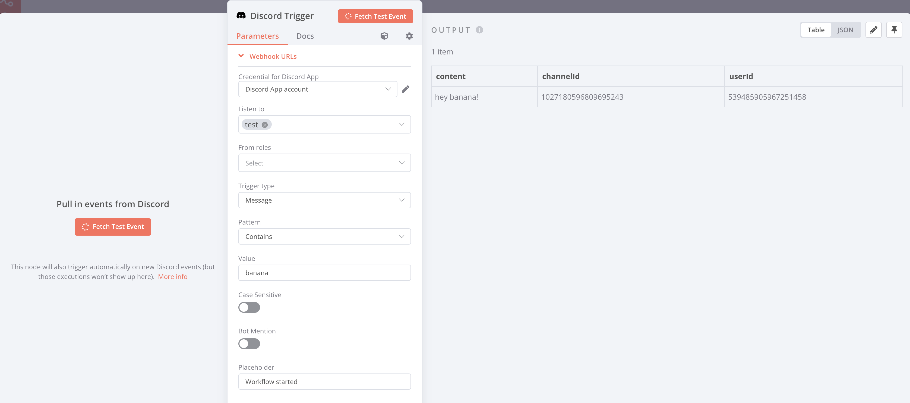

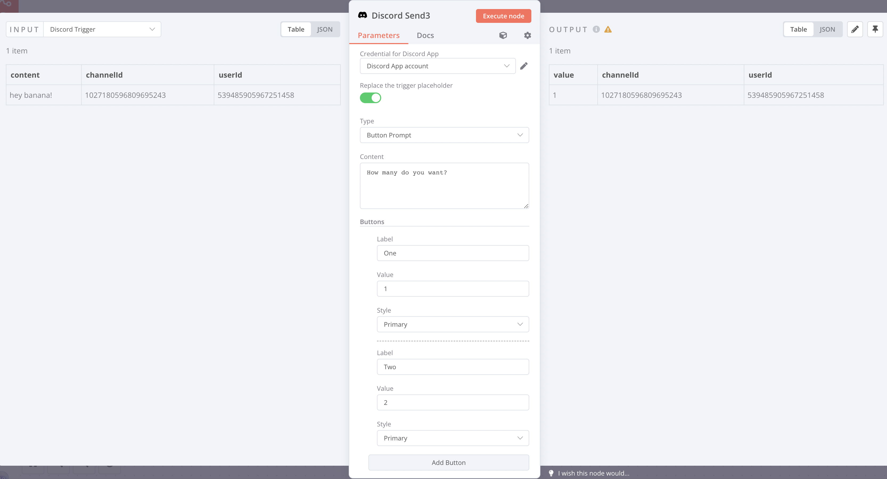

## License

MIT License

Copyright (c) 2024 [https://github.com/edbrdi](https://github.com/edbrdi)

Permission is hereby granted, free of charge, to any person obtaining a copy
of this software and associated documentation files (the "Software"), to deal
in the Software without restriction, including without limitation the rights
to use, copy, modify, merge, publish, distribute, sublicense, and/or sell
copies of the Software, and to permit persons to whom the Software is
furnished to do so, subject to the following conditions:

The above copyright notice and this permission notice shall be included in all
copies or substantial portions of the Software.

THE SOFTWARE IS PROVIDED "AS IS", WITHOUT WARRANTY OF ANY KIND, EXPRESS OR
IMPLIED, INCLUDING BUT NOT LIMITED TO THE WARRANTIES OF MERCHANTABILITY,
FITNESS FOR A PARTICULAR PURPOSE AND NONINFRINGEMENT. IN NO EVENT SHALL THE
AUTHORS OR COPYRIGHT HOLDERS BE LIABLE FOR ANY CLAIM, DAMAGES OR OTHER
LIABILITY, WHETHER IN AN ACTION OF CONTRACT, TORT OR OTHERWISE, ARISING FROM,
OUT OF OR IN CONNECTION WITH THE SOFTWARE OR THE USE OR OTHER DEALINGS IN THE
SOFTWARE.
